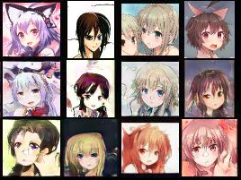
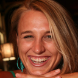
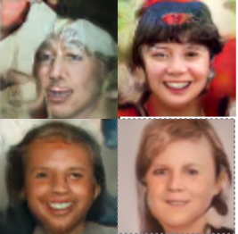
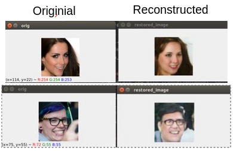
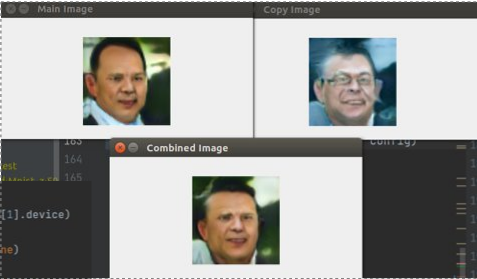
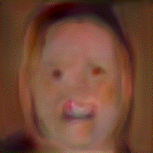

## Pytorch-ALAE

## Original Repos and Difference 
Source: The ALAE part of this repo is copied from https://github.com/ariel415el/SimplePytorch-ALAE 

Difference: Added New Dataset for Anime Character.

Source: The FID part of this repo is copied from https://github.com/hukkelas/pytorch-frechet-inception-distance/tree/c4bef90e502e7e1aec2a1a8f45b259630e093f8b

Difference: Original Repo will crash if loading a large database since it read all images at once and they are stored in the RAM, the new implementation will read the path to get the images during calculation of the fid

Please checkout their github and thank you for their contribution

The anime dataset can be downloaded in here: https://drive.google.com/drive/folders/13H-8T0fbRxTT8SPE_5PoEG9hVUCe8sWO?usp=sharing Put the folder named Twdne-128 into data folder , them put another .pt dataset file inside the Twdne-128 Folder. Please checkout the following file structure.

The result after training for 100000 iterations is as below,

 

The first row : Original Image
The second row : Reconstructed Image
The third row : Random Generated Image by Noise

## File Structure: 
	Lassests 
	Ldnn 
	... 
	Ldata 
        LTwdne-128 
            Ltwdne.pt
			
## Training: 
Remember to add argument when you run training: 

    python train_StyleALAE--dataset_name twdne
##Evaluation Method 
##1. FID
If you do not have two dataset for comparison, you need to generate a reconstructed one or a random generated one to compare with the original dataset.
Anyways, you can just use the test dataset in the repo. 

Just a reminder, the two datasets do not necessary need to have the same size

  

LHS is Original , RHS is Reconstructed Image

Command:

	python ./score_calculator/fid.py --path1 ../data/Test/original --path2 ../data/Test/reconstruct --batch-size 8

Result:

    Looking for images in ../data/Test/original/*.png
    Looking for images in ../data/Test/original/*.jpg
    Looking for images in ../data/Test/reconstruct/*.png
    Looking for images in ../data/Test/reconstruct/*.jpg
    Calculating Activation
     Progress: [------------------->] 100 %--Done--
    Calculating Activation
     Progress: [------------------->] 100 %--Done--
    The FID of these datasets :  133.45649989750808
    Finished

##2. PPL in W and Z latent Space
Please download the vgg.pt file from Nvidia Website : 'https://nvlabs-fi-cdn.nvidia.com/stylegan2-ada-pytorch/pretrained/metrics/vgg16.pt'
or download it from Google Drive: https://drive.google.com/file/d/1EC1m_4Ae-54zYSfW8swKSyrmou-MSQtj/view?usp=sharing

Then , Put the vgg16.pt into the "score_calculator" folder

Command:

    python score_calculator/ppl.py

Result:

    Checkpoint ckpt_gs-120000_res-5=64x64_alpha-0.40.pt loaded. Starting from resolution number 5 and global_step 120000
    Calculating on  w  latent space , path length is  full
     Progress: [------------------> ] 99 %Finished
    The PPL is  152.44447
    Calculating on  w  latent space , path length is  end
     Progress: [------------------> ] 99 %Finished
    The PPL is  96.42851
    Calculating on  z  latent space , path length is  full
     Progress: [------------------> ] 99 %Finished
    The PPL is  384.7624
    Calculating on  z  latent space , path length is  end
     Progress: [------------------> ] 99 %Finished
    The PPL is  424.26343
    
    Process finished with exit code 0

## Inferencing the ALAE 
## Reconstructing or Generate Images using ALAE
If you want to reconstruct / generate image , you can run the test_StyleALAE file, but remember that you need to set up the pretrained model path:

-Select your model in the path

-Select the location of saving in the saved_path 

-Remember to set the alpha value to a correct value , this info should be available on the name of your pt file 

-Remember only to Uncomment one of the function: generate_img , generate_img_with_truncation , reconstruct_img , generate_style_mixing_img

    if __name__ == '__main__':
        path = "./data/FFHQ-thumbnails/thumbnails128x128"
        reconstruction_saved_path = "./data/FFHQ-thumbnails/reconstructed_thumbnails128x128"
        generation_saved_path = "./data/FFHQ-thumbnails/generated_thumbnails128x128"
        model = StyleALAE(model_config=config, device=device)
        model.load_train_state('./archived/FFHQ/StyleALAE-z-256_w-256_prog-(4,256)-(8,256)-(16,128)-(32,128)-(64,64)-(64,32)/checkpoints/ckpt_gs-120000_res-5=64x64_alpha-0.40.pt')
        batch_size = 32
    
    generate_img(model, config, generation_saved_path, True, 3, alpha=0.4, batch_size=32)
    # reconstruct_img(model, config, path, reconstruction_saved_path, True, alpha=0.4)
    # generate_style_mixing_img(model, config, alpha=0.4, copystyleto=[4,8])
    # generate_img_with_truncation(model, config, alpha=0.4)

Command: 

	python test_StyleALAE

##1. Generate Image

Function:

    generate_img(model, config, saved_path, show, generation_size, alpha=0.4, batch_size=32)

show - option for displaying the generated image
generation size - represent how many images are going to be generated, 

Result:

 

##2. Reconstruct Image

Function:

    reconstruct_img(model, config, path, saved_path, show, alpha=0.4)

show - option for displaying the generated image

Result:

 
	
##3. Image StyleMixing

Function:

    generate_style_mixing_img(model, config, alpha=0.4, copystyleto=[4,8])

Two latent code are used in style mixing , 
-The main latent code cotributes to most input of generator
-The latent code for copying contributes to part of the input, this can be control using the "copystyleto" option
copystyleto - option for using the latent code for copying in different resolutions

Result:

 

##4. Image Truncation

Function:

    generate_img_with_truncation(model, config, alpha=0.4)

Result

